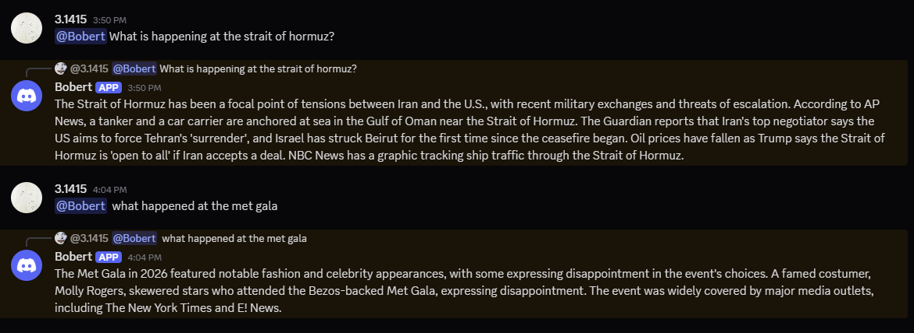
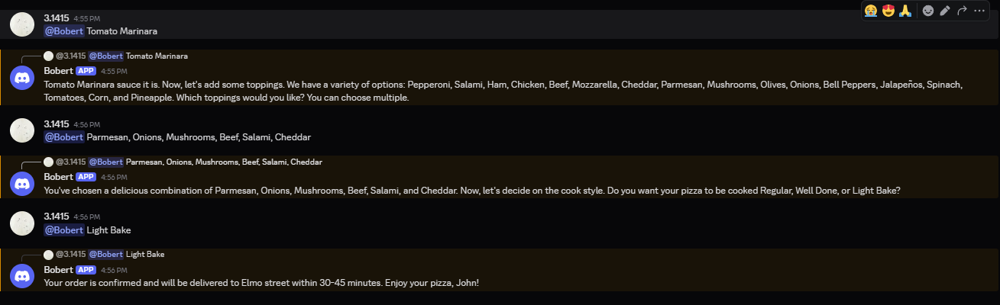
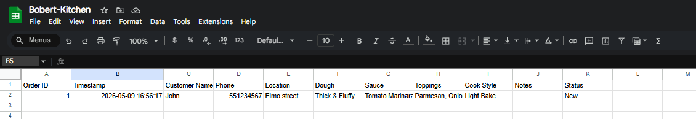

# Bobert — Discord AI Bot

An agentic AI bot for Discord that can search the live web and take pizza orders end-to-end, writing them straight to a Google Sheet for the kitchen to see.

Built entirely from scratch in Python over a single day as a way to build AI agent powered systems for real world use cases such as ordering pizzas without any human in the loop and via text.

---

## What it does

### Live web search
Ask Bobert anything about current events, news, or recent facts and it searches the web in real time using Tavily, then answers directly with the results.



### Pizza ordering — full conversational flow
Say "I want to order a pizza" and Bobert walks you through the entire menu across multiple messages — dough type, sauce, toppings, cook style, your name, phone, and address.




### Orders land in Google Sheets automatically
Once confirmed, the order is written to a live Google Sheet that the kitchen staff can see instantly. No manual entry, no middleman.



---

## Tech stack

| Layer | Technology |
|---|---|
| Bot framework | [discord.py](https://discordpy.readthedocs.io/) |
| LLM | [Llama 3.3 70B](https://groq.com) via Groq API |
| Web search | [Tavily API](https://tavily.com) |
| Google Sheets | [gspread](https://gspread.readthedocs.io/) + Google Service Account |
| HTTP client | [aiohttp](https://docs.aiohttp.org/) (fully async) |
| Language | Python 3.11+ |

---

## Project structure

```
Discord-AI-Bot/
├── main.py                  # Discord bot entry point
├── src/
│   ├── agent.py             # Agentic loop — calls model, handles tool use, loops
│   ├── client.py            # Groq API client (async, with retry + error recovery)
│   ├── tools_registry.py    # Registers all tools and dispatches calls
│   └── logger.py            # File + console logging setup
├── tools/
│   ├── web_search.py        # Tavily web search tool
│   └── order.py             # Pizza order tool (calls Google Sheets)
├── database/
│   ├── sheets.py            # Google Sheets read/write logic
│   └── service_account.json # Google service account key (never committed)
├── logs/                    # Daily rotating log files (never committed)
├── assets/screenshots/      # README screenshots
├── .env                     # All API keys (never committed)
├── .gitignore
└── requirements.txt
```

---

## Installation

### 1. Clone the repo

```bash
git clone https://github.com/yourusername/Discord-AI-Bot
cd Discord-AI-Bot
```

### 2. Create a virtual environment

```bash
python -m venv .venv
.venv\Scripts\activate      # Windows
source .venv/bin/activate   # Mac/Linux
```

### 3. Install dependencies

```bash
pip install -r requirements.txt
```

### 4. Set up your API keys

Create a `.env` file in the root folder:

```
DISCORD_TOKEN=your_discord_bot_token
GROQ_API_KEY=your_groq_api_key
TAVILY_API_KEY=your_tavily_api_key
GOOGLE_SHEET_ID=your_google_sheet_id
```

### 5. Add the Google service account key

Place your `service_account.json` file inside the `database/` folder.
This file is gitignored and will never be committed.

### 6. Run the bot

```bash
python main.py
```

---

## Getting the API keys

### Discord bot token
1. Go to [discord.com/developers/applications](https://discord.com/developers/applications)
2. New Application → Bot → copy the token
3. Under Bot, enable **Message Content Intent**
4. OAuth2 → URL Generator → scopes: `bot` → permissions: Send Messages, Read Message History, View Channels → invite to your server

### Groq API key (free)
1. Sign up at [console.groq.com](https://console.groq.com)
2. API Keys → Create new key

### Tavily API key (free tier available)
1. Sign up at [tavily.com](https://tavily.com)
2. Dashboard → copy your API key

### Google Sheets (service account)
1. Go to [console.cloud.google.com](https://console.cloud.google.com) → New Project
2. APIs & Services → Library → enable **Google Sheets API**
3. APIs & Services → Credentials → Create Credentials → **Service Account**
4. Click the service account → Keys → Add Key → JSON → save as `database/service_account.json`
5. Create a Google Sheet → copy the ID from the URL (`/spreadsheets/d/THIS_PART/edit`)
6. Share the sheet with the service account email (shown in Credentials) — give it **Editor** access

---

## How it works — the agentic loop

Bobert is not a simple chatbot. It runs an **agentic loop**:

```
User message
    ↓
Model decides: answer directly OR call a tool
    ↓ (if tool call)
Tool executes (web search / place order)
    ↓
Result fed back to model
    ↓
Model decides: answer now OR call another tool
    ↓ (repeat until done)
Final answer sent to Discord
```

This means for a question like *"what's happening in Gaza?"* the model will:
1. Decide it needs fresh data
2. Call `web_search` with a query
3. Get the live results back
4. Write a proper answer using those results

And for an order like *"I want a pizza"* it will:
1. Start asking for details across multiple messages (multi-turn memory per user)
2. Once it has everything, call `place_order`
3. `place_order` writes the row to Google Sheets
4. Confirm the order to the user

---

## What I learned building this

This project was my introduction to building real AI automation from scratch. Key things I picked up:

**Agentic AI** — the difference between a chatbot (question → answer) and an agent (question → think → act → observe → repeat). The loop in `src/agent.py` is the core of how modern AI assistants work.

**Tool calling** — how to define tools the model can invoke, pass structured arguments, get results back, and feed them into the next model call. This is the foundation of how AI integrates with real systems.

**Async Python** — the entire bot is `async`/`await` so Discord, the Groq API, and Tavily all run concurrently without blocking each other. Used `asyncio.Lock` per user to prevent race conditions.

**API integration** — chaining together four different APIs (Discord, Groq, Tavily, Google Sheets) each with their own auth, rate limits, and error formats. Learned to handle 429 rate limits with retry logic and recover from malformed model outputs.

**Error resilience** — Llama 3.3 sometimes generates tool calls in broken XML formats instead of proper JSON. Built a multi-pattern parser to recover from these automatically rather than crashing.

**Structured logging** — every decision, tool call, and API response is logged to daily files in `logs/`. Being able to read exactly what the bot was doing when something went wrong made debugging 10x faster.

**Google Sheets as a database** — for a small kitchen operation, a Google Sheet is a practical, zero-infrastructure database that non-technical staff can read and update directly.

---

## Usage

Once running, @ mention the bot in any Discord channel:

```
@Bobert what is happening at the Strait of Hormuz?
@Bobert hey i want to order a pizza
```

For pizza orders, just follow the conversation — Bobert will ask for everything it needs.

---

## Security notes

- `.env` and `database/service_account.json` are in `.gitignore` and will never be committed
- Verify before pushing: `git check-ignore .env` and `git check-ignore database/service_account.json` — both should print the filename
- If you accidentally commit either file, rotate the keys immediately
